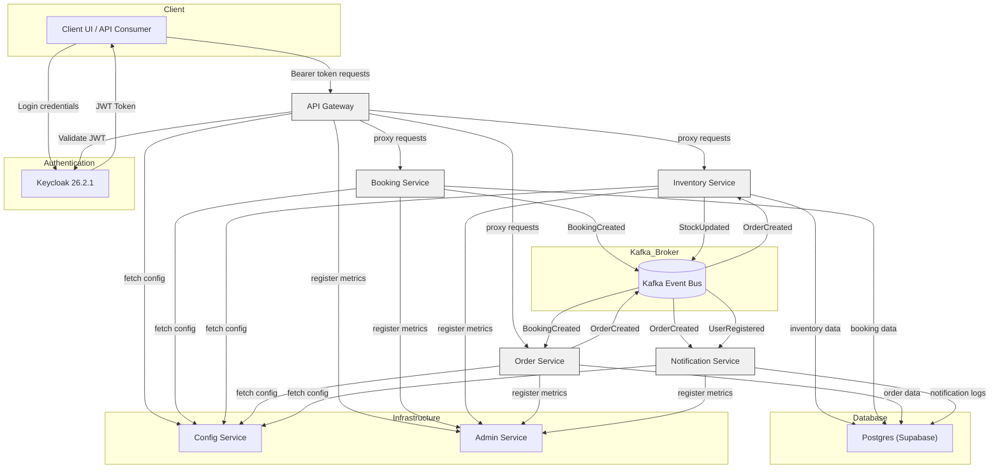

# Architecture
you can see [the data flow diagram in the product doc](/doc/product.md)

### !!! To BE Decided:
[] To do Add write up for this diagram?

# system design diagram

```mermaid
flowchart TD

%% Client
    subgraph Client
        client[Client UI / API Consumer]
    end

%% Auth Server
    subgraph Authentication
        keycloak[Keycloak 26.2.1]
    end

%% Kafka
    subgraph Kafka_Broker
        kafka[(Kafka Event Bus)]
    end

%% Database
    subgraph Database
        db["Postgres (Supabase)"]
    end

%% Infrastructure
    subgraph Infrastructure
        config[Config Service]
        admin[Admin Service]
    end

%% Microservices
    api[API Gateway]:::service
    inventory[Inventory Service]:::service
    booking[Booking Service]:::service
    order[Order Service]:::service
    notify[Notification Service]:::service

%% Authentication flow
    client -- Login credentials --> keycloak
    keycloak -- JWT Token --> client

%% API Gateway usage
    client -- Bearer token requests --> api
    api -- Validate JWT --> keycloak

%% API Routing
    api -- proxy requests --> inventory
    api -- proxy requests --> booking
    api -- proxy requests --> order

%% Event Flow via Kafka
    booking -- BookingCreated --> kafka
    order -- OrderCreated --> kafka
    inventory -- StockUpdated --> kafka

    kafka -- BookingCreated --> order
    kafka -- OrderCreated --> inventory
    kafka -- OrderCreated --> notify
    kafka -- UserRegistered --> notify

%% Database interactions
    inventory -- inventory data --> db
    booking -- booking data --> db
    order -- order data --> db
    notify -- notification logs --> db

%% Infrastructure connections
    api -- fetch config --> config
    booking -- fetch config --> config
    inventory -- fetch config --> config
    order -- fetch config --> config
    notify -- fetch config --> config

    api -- register metrics --> admin
    booking -- register metrics --> admin
    inventory -- register metrics --> admin
    order -- register metrics --> admin
    notify -- register metrics --> admin

%% Styles
    classDef service fill:#f0f0f0,stroke:#333,stroke-width:1px;

```
