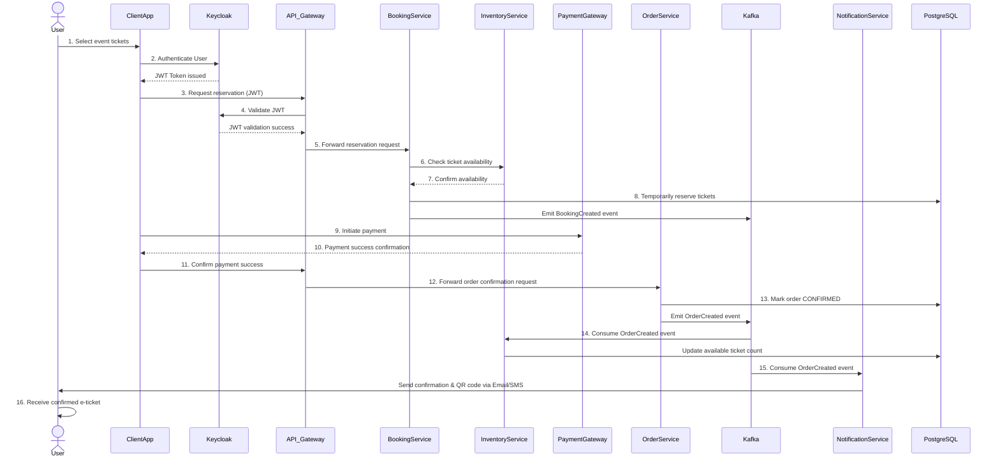

# 🎟️ User Journey on elTiketi

### Step by step flow
**Step 1: User Initiates Purchase**
User opens the app and selects desired tickets (event, ticket type, quantity).

**Step 2: User Authenticates via Keycloak**
Client redirects user to Keycloak; user logs in.

→ Keycloak authenticates user and returns JWT.

**Step 3: Ticket Reservation Request**
User confirms reservation in UI.

→ App sends request (JWT, event details) to API Gateway.

**Step 4: API Gateway Validates JWT**
API Gateway verifies JWT via Keycloak (token introspection).

**Step 5: API Gateway Forwards Request to Booking Service**
API Gateway sends reservation request (user/event details) to Booking Service.

**Step 6: Booking Service Checks Inventory**
Booking Service queries Inventory Service for ticket availability.

**Step 7: Inventory Service Confirms Availability**
Inventory Service confirms available stock, returns confirmation to Booking Service.

**Step 8: Booking Service Temporarily Reserves Tickets**
Booking Service temporarily holds tickets (e.g., 15 min) in the database.

→ Emits a BookingCreated event to Kafka.

**Step 9: Client Initiates Payment**
User completes payment via integrated Payment Gateway (e.g., Stripe Checkout).

**Step 10: Payment Gateway Confirms Payment**
Payment Gateway confirms successful payment back to client.

**Step 11: Client Confirms Successful Payment to API Gateway**
Client app sends payment success confirmation to API Gateway.

**Step 12: API Gateway Forwards Order Request to Order Service**
API Gateway sends confirmation request (booking ID, user details) to Order Service.

**Step 13: Order Service Finalizes Order**
Order Service verifies reservation, marks order as CONFIRMED in database.

→ Emits an OrderCreated event to Kafka.

**Step 14: Inventory Service Adjusts Inventory**
Inventory Service listens to OrderCreated event from Kafka.

→ Updates available ticket count in database.

**Step 15: Notification Service Sends Confirmation**
Notification Service listens to OrderCreated event from Kafka.

→ Sends email/SMS notification with secure e-ticket (QR code) to user.

**Step 16: User Receives Ticket**
User receives confirmed e-ticket notification via email or SMS.

## Data Flow: Ticket Purchase

